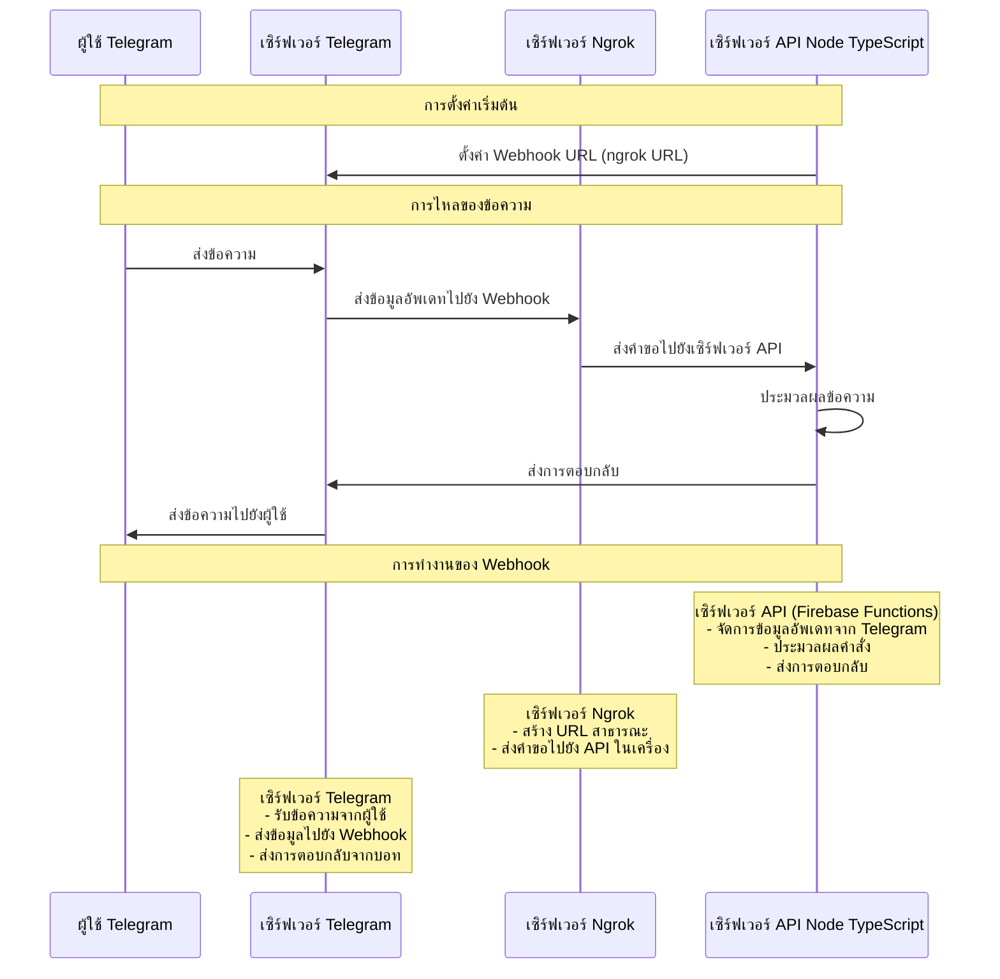

## คำอธิบายสถาปัตยกรรม

1. **ผู้ใช้ Telegram**: ผู้ใช้ปลายทางที่โต้ตอบกับบอทผ่าน Telegram
2. **เซิร์ฟเวอร์ Telegram**: เซิร์ฟเวอร์ทางการของ Telegram ที่จัดการการส่งข้อความ
3. **เซิร์ฟเวอร์ Ngrok**: สร้างอุโมงค์ที่ปลอดภัยไปยังเซิร์ฟเวอร์ API ในเครื่อง
4. **เซิร์ฟเวอร์ API Node TypeScript**: เซิร์ฟเวอร์ Firebase Functions ที่ประมวลผลข้อความ

### คำอธิบายการทำงาน

1. **การตั้งค่าเริ่มต้น**:

   - เซิร์ฟเวอร์ API ตั้งค่า URL ของ webhook กับ Telegram โดยใช้ URL ของ Ngrok
   - นี่เป็นการบอก Telegram ว่าจะส่งข้อมูลอัพเดทไปที่ไหน

2. **การไหลของข้อความ**:

   - ผู้ใช้ส่งข้อความไปยังบอท
   - Telegram ส่งข้อมูลไปยัง URL ของ webhook (Ngrok)
   - Ngrok ส่งคำขอไปยังเซิร์ฟเวอร์ API ในเครื่อง
   - เซิร์ฟเวอร์ API ประมวลผลข้อความและส่งการตอบกลับ
   - Telegram ส่งการตอบกลับไปยังผู้ใช้

3. **บทบาทของเซิร์ฟเวอร์**:
   - **เซิร์ฟเวอร์ API**: จัดการตรรกะของบอททั้งหมด ประมวลผลคำสั่ง และสร้างการตอบกลับ
   - **เซิร์ฟเวอร์ Ngrok**: ให้ URL สาธารณะเพื่อให้ Telegram สามารถเข้าถึง API ในเครื่องได้
   - **เซิร์ฟเวอร์ Telegram**: จัดการการส่งและรับข้อความ
